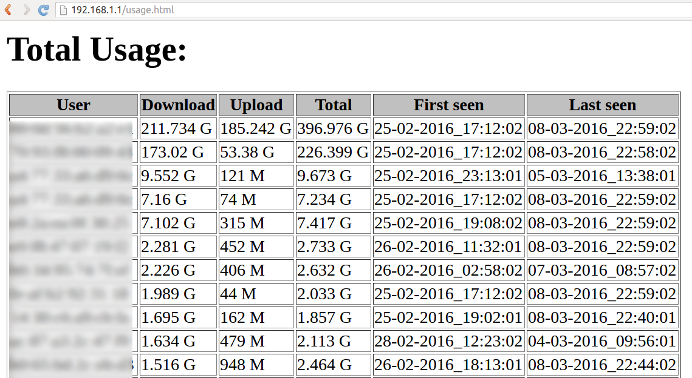

# wrtbwmon
Modified from https://code.google.com/p/wrtbwmon/.

## New features
 - "User" column has mouseover text containing MAC and IP addresses
 - "First seen" and "Total" columns in usage table
 - Monitoring of locally generated traffic on a per-interface basis
 - `remove` function to delete `iptables` rules

### What does it do?
`wrtbwmon` was designed to track bandwidth consumption on home routers. 
It accomplishes this with `iptables` rules, which means you don't need to run an extra process just to track bandwidth. 
`wrtbwmon` conveniently tracks bandwidth consumption on a per-IP address basis, 
so you can easily determine which user/device is the culprit.

Here is an example usage table:

### How do I use it?
- Install: Download and install ipk from the [releases page](https://github.com/pyrovski/wrtbwmon/releases/)
- Setup: `wrtbwmon.sh setup`
- Update table: `wrtbwmon.sh update /tmp/usage.db` (you can place the data table anywhere)
- Create html page: `wrtbwmon.sh publish /tmp/usage.db /tmp/usage.htm`

### Installation options
- Install ipk
  - e.g.,: 
    - `cd /tmp`
    - HTTPS: `curl -LO https://github.com/pyrovski/wrtbwmon/releases/download/0.3/wrtbwmon_0.3_all.ipk`
    - HTTP: you're on your own :( Busybox wget usually doesn't have SSL support.
    - OpenWrt: `opkg install /tmp/wrtbwmon_0.3_all.ipk`
- Or, if you don't want to use an ipk:
  - `cd /tmp`
  - HTTPS: `curl -L https://github.com/pyrovski/wrtbwmon/archive/0.3.tar.gz | tar xvz`
  - `cd wrtbwmon-0.3`
  - `./install.sh wrtbwmon.sh readDB.awk usage.htm1 usage.htm2 wrtbwmon`
    - Currently, this depends on the `install` program. OpenWrt chose to provide this as the "coreutils-install" package.
- Or, if you have `make`, just `make install` as root after cloning/unpacking.

### Configuring the published table
- `wrtbwmon.sh` checks a few files for MAC -> name maps:
  - 4th argument to `wrtbwmon.sh publish <DB> <userDB>`
  - `/tmp/dhcp.leases`
  - `/tmp/dnsmasq.conf`
  - `/etc/dnsmasq.conf`
  - `/etc/hosts`
- If all of the above do not yield a match, the script will optionally perform a reverse DNS lookup directed at the DNS server specified in the `DNS` variable. If `DNS` is blank or unset, the script will not perform such lookups.

### Regular updates
- Add the following to root's crontab:

        # adapt PATH to your needs
        PATH=/usr/local/sbin:/usr/local/bin:/usr/sbin:/usr/bin:/sbin:/bin
	
        * * * * * <script location> update /tmp/usage.db
        0 * * * * <script location> publish /tmp/usage.db /tmp/usage.htm

- Enable web serving of the generated page (optional)
  - This varies by environment, but for lighttpd:
    - ln -s /tmp/usage.htm /var/www/html/

### Remove `iptables` rules
 - `wrtbwmon.sh remove`
